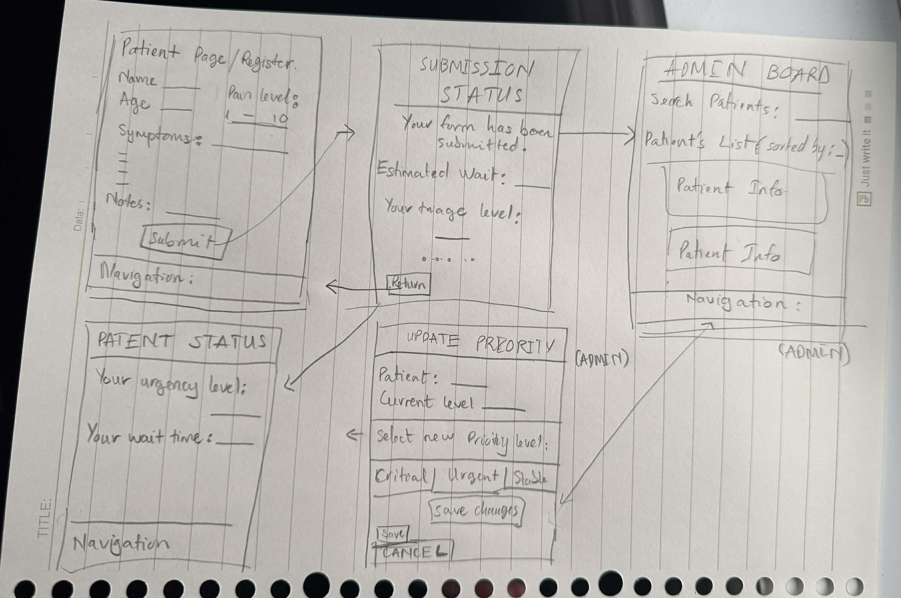

# Hospital Triage App Design System
### CST3106 – Lab 10  
**Name:** Chi Duong

## 1. Design Overview
The Hospital Triage App is designed to support both patients and hospital staff during the emergency intake process. The interface emphasizes clarity, accessibility, and speed so users can navigate and process information under pressure. The visual design supports fast scanning, intuitive interaction, and medical-grade readability.

## 2. Fonts

### Primary Font — Inter
Used for headings, navigation labels, and buttons.  
Chosen because it is:
- Highly legible on screens  
- Clean and modern  
- Ideal for medical interfaces where fast readability matters

### Secondary Font — Roboto
Used for body text and descriptions.  
Selected because:
- It is easy to read in longer paragraphs  
- Has soft, balanced letterforms  
- Pairs smoothly with Inter for a professional UI

## 3. Colour Palette (Blue Healthcare Theme)

### Primary Colours
| Purpose | Hex | Description |
|--------|------|-------------|
| Primary Blue | #2563EB | Main actions, primary buttons |
| Dark Blue | #1E40AF | Admin section emphasis |

### Status & Alerts
| Status | Hex | Use |
|--------|------|------|
| Success Green | #22C55E | Stable condition |
| Warning Yellow | #FBBF24 | Urgent level |
| Critical Red | #EF4444 | Critical patient alert |

### Neutral Shades
| Purpose | Hex |
|--------|------|
| Light Background | #F9FAFB |
| Input Fields | #F3F4F6 |
| Text | #4B5563 |
| Borders | #D1D5DB |

## 4. App Components

### Titles
- Inter Bold, large size  
- Examples:  
  - “Triage Intake”  
  - “Admin Dashboard”

### Buttons
- Rounded rectangular  
- Primary (Blue)  
- Critical (Red)  
- Secondary (White with border)

### Input Fields
- Light grey background  
- Subtle border  
- Placeholder text using Roboto Light  
- Blue border on focus

### Patient Intake Form
Includes:
- Name, age  
- Symptoms  
- Pain level (1–10)  
- Notes  
- Submit button

### Admin Dashboard Cards
Each card shows:
- Patient name  
- Symptoms  
- Triage priority (colour-coded)  
- Arrival time  
- Update Priority button

## 5. Layout and Navigation

### Patient View Navigation
- Bottom navigation bar with:
  - Home  
  - Intake Form  
  - Status  

### Admin View Navigation
- Top navigation bar:
  - Dashboard  
  - Patients  
  - Alerts  

### Layout Approach
- Mobile-first grid  
- Clear spacing (8/16/24px scale)  
- Important actions placed near center or bottom for thumb comfort  

## 6. Consistency

Consistency is maintained through:
- Shared typography system  
- Standardized colour usage (e.g., red only for alerts)  
- Uniform component shapes and spacing  
- Identical behaviour patterns across pages  

## 7. Wireframes (Based on Hand-Drawn Sketches)

## 8. Functionality
The app supports:
- Fast patient data submission  
- Real-time triage updates  
- Staff ability to update priorities  
- Clear visibility for critical patients  
- Smooth navigation between patient and admin features  

