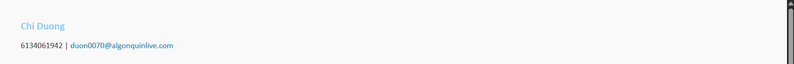
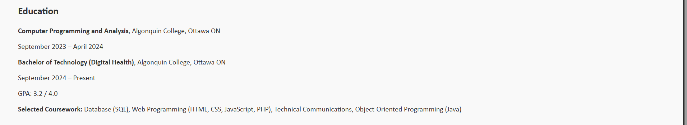
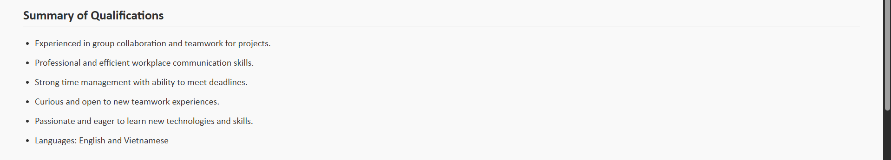
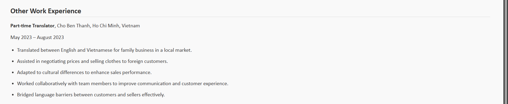

# **Chi Duong — Portfolio Design System (Lab 04)**  

**Course:** CST3106 – Web Programming   
**Project:** Lab 4   

---

## ️ 1. Introduction  

This document describes the **design system** used for my personal portfolio and resume website. 
It explains my **fonts, colors, and layout choices**, along with component styles such as headers, sections, and links.  
All examples and mock-ups are based on my HTML and CSS code from the `resume.html` project.  

---

##  2. Color Palette  

| **Element** | **Color** | **Hex Code** | **Usage** |
|--------------|------------|---------------|------------|
| Background | Light Gray | `#f9f9f9` | Overall background for calm and professional appearance |
| Text | Dark Gray | `#333333` | Main text color for readability |
| Name Highlight | Light Sky Blue | `#87CEFA` | Accent for the name in header |
| Borders | Soft Gray | `#dddddd` | Section title underlines and dividers |
| Links | Medium Blue | `#007ACC` | Used for email and hyperlink text |

> The soft color palette creates a **minimalist and professional** look. Blue accents add a friendly, approachable tone.

---

## 3. Typography  

| **Element** | **Font Family** | **Size** | **Weight / Style** | **Purpose** |
|--------------|-----------------|-----------|--------------------|--------------|
| Body Text | `"Calibri", sans-serif` | 16px | Regular | Clear and easy to read |
| Section Headings (`h2`) | `"Calibri", sans-serif` | 22px | Bold | Highlights each section |
| Name (`.p1`) | `"Calibri", sans-serif` | 20px | Bold, Light Blue | Adds personality and hierarchy |

The **Calibri** font family was chosen for its modern and clean appearance, which aligns well with professional documents and resumes.

---

##  4. Layout and Spacing  

### Page Structure
- **Single-column layout** for simple vertical reading flow.  
- **Page margin:** `40px` on all sides for balanced whitespace.  
- **Section spacing:** `margin: 40px 0;` separates major content areas.  
- **Consistent rhythm:** lists and paragraphs have equal spacing for readability.

### Example Layout Diagram
```

 Name and Contact Info (Header)       
 Education Section                    
 Summary of Qualifications             
 Work Experience                       

```

---

## 5. Components  

### **Header**
Displays name and contact information.

```html
<header>
  <div class="info">
    <p class="p1">Chi Duong</p>
    <p>6134061942 | <a href="mailto:duon0070@algonquinlive.com">duon0070@algonquinlive.com</a></p>
  </div>
</header>
```

**Design Details:**
- Name color: `lightskyblue`
- Font size: `20px`
- Centered or top-aligned on the page
- Email link opens default mail app

---

### **Section Block**
Used for each major resume category (Education, Skills, Work Experience).

```html
<section class="section">
  <h2>Education</h2>
  <p><strong>Computer Programming and Analysis</strong>, Algonquin College</p>
  <p>September 2023 – April 2024</p>
</section>
```

**Styling:**
- `h2` headings have a bottom border (`#ddd`)
- Section margins: `40px 0`
- Text aligned left, uniform spacing

---

### **Unordered List (Qualifications / Tasks)**

```html
<ul>
  <li>Experienced in group collaboration.</li>
  <li>Strong time management and problem-solving skills.</li>
  <li>Bilingual: English and Vietnamese.</li>
</ul>
```

**Design Features:**
- Padding-left: `20px`
- Line height: `1.6`
- Clean and simple bullet points

---

### **Links**
- Color: `#007ACC`
- Hover: underline (no color change)
- Purpose: used for contact email and future portfolio navigation

```css
a {
  color: #007acc;
  text-decoration: none;
}
a:hover {
  text-decoration: underline;
}
```

---

##  6. CSS Summary  

```css
body {
  font-family: "Calibri", sans-serif;
  margin: 40px;
  background-color: #f9f9f9;
  color: #333;
}

.p1 {
  font-weight: bold;
  color: lightskyblue;
  font-size: 20px;
  margin-bottom: 5px;
}

.info { margin: 3px 0; }

h2 {
  font-size: 22px;
  margin-bottom: 10px;
  color: #333;
  border-bottom: 1px solid #ddd;
  padding-bottom: 5px;
}

.section { margin: 40px 0; }

ul {
  padding-left: 20px;
}

ul li {
  margin-bottom: 8px;
  line-height: 1.6;
}

a {
  color: #007acc;
  text-decoration: none;
}

a:hover {
  text-decoration: underline;
}
```

---

## ️ 7. Mock-ups / Screenshots  

Below are screenshots from the actual web page to visualize the design.  








##  8. Accessibility Considerations  


- **Links:** Underline on hover ensures keyboard and mouse users can identify links.  
- **Font readability:** Calibri is easy to read both on screens and print.  
- **Color-blind friendly:** Blue and gray palette avoids problematic red-green contrasts.

---

##  9. Future Improvements  

| Feature | Plan |
|----------|------|
| Responsive Design | Add media queries for mobile (smaller margins, font size adjustments) |
| Print Optimization | Adjust margins and colors for printing resumes |
| Navigation Bar | Add top navigation to move between portfolio pages |
| Additional Accent Colors | Introduce secondary color for headings or buttons |

---

## 10. References  

- [W3Schools CSS Colors](https://www.w3schools.com/css/css_colors.asp)  
- [W3Schools Fonts Guide](https://www.w3schools.com/css/css_font.asp)  
- [Markdown Guide](https://www.markdownguide.org/cheat-sheet/)  
- [GitHub Markdown Syntax](https://docs.github.com/en/get-started/writing-on-github)  


###  Author: *Chi Duong*  
**Email:** [duon0070@algonquinlive.com](mailto:duon0070@algonquinlive.com)
