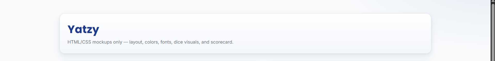
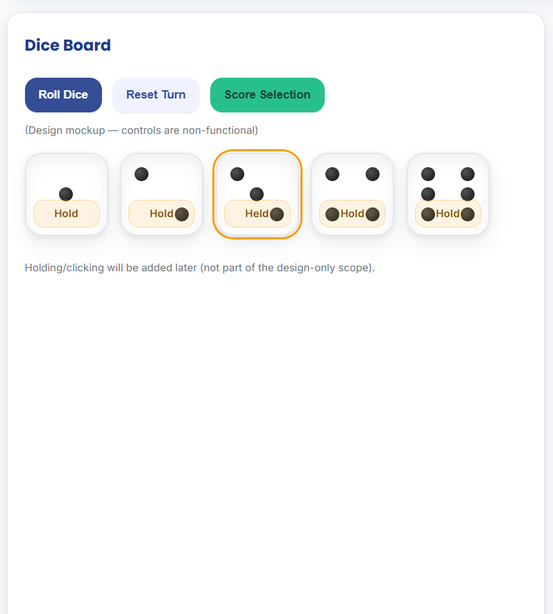
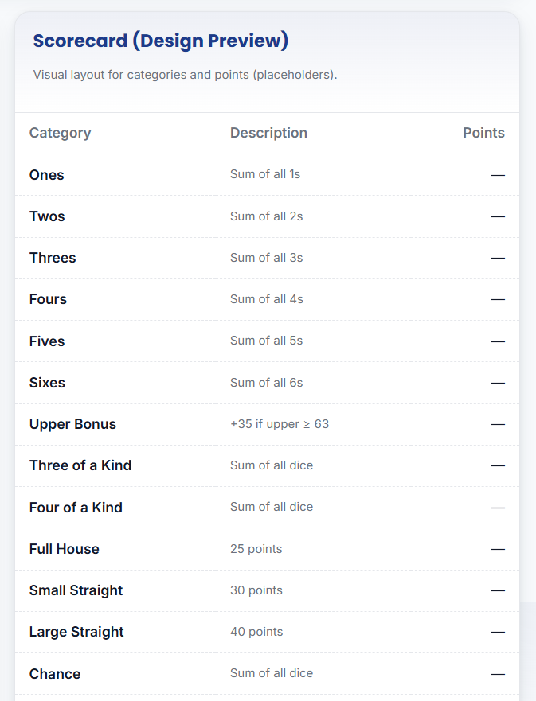
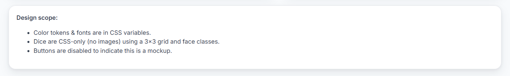

# 🎲 Yatzy — HTML/CSS Design Mockups

**Scope:** *Design-only* (HTML/CSS). No JavaScript or game logic yet.

---

## 1. Game Overview

This project is a visual mockup of the classic dice game **Yatzy**. The interface shows:
- A **dice board** with 5 dice,
- A **control row** with buttons (non-functional in this mockup),
- A **scorecard** with standard Yatzy categories.

The goal of Yatzy is to roll five dice and earn points based on combinations such as pairs, straights, or “Yatzy” (five of a kind).  

This lab focuses on **user interface and visual design** only

---

## 2. Design System Documentation

### Color Palette

| Role | Variable | Hex | Description |
|------|-----------|-----|-------------|
| Primary | `--color-primary` | `#1E3A8A` | Deep blue used for titles and key buttons — represents focus and trust. |
| Secondary | `--color-secondary` | `#F59E0B` | Warm golden accent for highlights and “Hold” badges on dice. |
| Accent | `--color-accent` | `#10B981` | Green accent used for confirmation or score actions. |
| Background | `--color-bg` | `#F8FAFC` | Light neutral background for readability. |
| Surface | `--color-surface` | `#FFFFFF` | Clean white card backgrounds for structure. |
| Text | `--color-text` | `#111827` | Dark text color for contrast and accessibility. |
| Muted | `--color-muted` | `#6B7280` | Used for hints and subtle labels. |

**Rationale:**  
The deep blue gives a professional, focused feel; gold adds warmth and energy; green is associated with positive progress.  
Together, they make the interface **friendly, balanced, and readable**.

---

### Fonts

- **Headings:** [Poppins](https://fonts.google.com/specimen/Poppins) (600–700)  
  Rounded, geometric, and modern — ideal for titles and section headings.
- **Body text:** [Inter](https://fonts.google.com/specimen/Inter) (400–600)  
  Clean, simple, and designed for high on-screen readability.

**Rationale:**  
Poppins gives the design personality and energy, while Inter maintains clarity and usability in dense text areas like the scorecard.

---

## 3. Dice Design

The dice are created **entirely in HTML and CSS**, using a 3×3 grid layout and small “pip” elements instead of images.

### Structure
Each `.die` element contains:
- 9 pip elements: ``  
- A small badge `Hold`  
- A face class (`.face-1` ... `.face-6`) that determines which pips are visible.

### CSS Logic
- `.die` uses **CSS Grid** (`grid-template-columns: repeat(3, 1fr)`) for the 3×3 layout.
- `.p-1`–`.p-9` are positioned in specific grid cells (like a tic-tac-toe board).
- All pips are hidden by default (`display:none`).
- Each `.face-*` class turns on specific pips with `display:block` to form the correct pattern.

### 🎯 Face Mappings
| Face | Visible Pips |
|------|---------------|
| 1 | 5 |
| 2 | 1, 9 |
| 3 | 1, 5, 9 |
| 4 | 1, 3, 7, 9 |
| 5 | 1, 3, 5, 7, 9 |
| 6 | 1, 3, 4, 6, 7, 9 |

### 💡 Extra Details
- Held dice are visually outlined in gold (`.die[aria-pressed="true"]`).
- The “Hold” badge shows below each die to preview the feature’s purpose.
- The dice tray aligns all dice in a grid using `grid-template-columns: repeat(5, 96px)`.

---

## 4. Game Mock-ups (Layout & Structure)

### Page Layout
The page uses a **two-column grid layout** (`.app`) with the **Dice Board** on the left and the **Scorecard** on the right.

| Section | Purpose |
|----------|----------|
| `<header class="app_header">` | Page title and subtitle card |
| `<section class="board">` | Dice area with disabled control buttons |
| `
` | Grid container holding five dice |
| `<aside class="scorecard">` | Table showing Yatzy categories and placeholder scores |
| `<section class="notes">` | Summary notes about design scope and checklist |

All cards share:
- Consistent border radius (`--radius`),
- Soft shadow (`--shadow`),
- White backgrounds (`--color-surface`).

---

### 📱 Responsive Design
- **Desktop (≥980px):** Two columns (Dice + Scorecard).  
- **Tablet (<980px):** Single column layout.  
- **Mobile (<600px):** Dice shrink to 88px and arrange in two columns.

This ensures the UI remains accessible and readable on all screen sizes.

---

## 5. Layout and Game Flow (Future Functionality)

When logic is added later with JavaScript:
1. The player will click **Roll Dice** to randomize all dice (`.face-*` changes).  
2. The player can **hold** dice between rolls (toggling a gold outline).  
3. The player chooses a **score category** from the table to record points.  
4. After all categories are filled, the **Total** is calculated to determine the final score.

The current mockup prepares the **visual foundation** for these interactive behaviors.

---

## 6. Accessibility & Documentation Notes

- Semantic HTML (using `<header>`, `<section>`, `<aside>`, `<table>`) improves readability and structure.  
- ARIA roles (`role="main"`, `aria-labelledby`, `aria-pressed`) preview future accessibility support.  
- `.visually-hidden` keeps text available for screen readers without showing it on screen.  
- All colors have high contrast against light backgrounds.

---

## 7.  Game Mock-ups — Visual Design Preview
###  Header Section

> The header card introduces the game and sets the tone with the primary blue color and subtitle.

### Dice Board

> Displays the five dice aligned in a grid, with buttons for *Roll*, *Reset*, and *Score Selection* (disabled in mockup mode).  
> The dice use CSS-only pips and include the “Hold” visual label.

---

### Scorecard Table

> Organized table for scoring categories, including both *Upper* (Ones–Sixes) and *Lower* (Three of a Kind–Yatzy) sections.  
> Uses semantic table tags and clear alignment for readability.

---

### Notes Section

> Lists the lab design scope and confirms the completed requirements.

---

